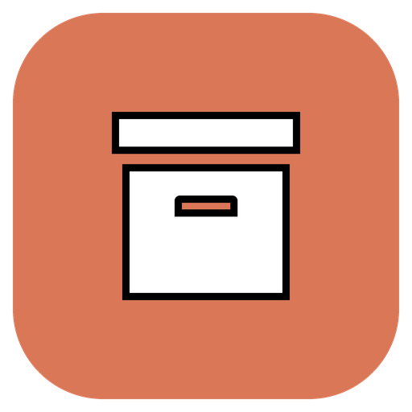

# Claude Code Archive

Keep every Claude Code session you ever run, forever, in Google Drive — while
your computer only holds the recent ones.

Claude Code stores session transcripts under `~/.claude/projects/` and deletes
them after 30 days by default. On a machine in daily use that is roughly 20–25 GB
a year if you keep them, and lost history if you do not. This plugin removes the
choice: Drive holds everything, the disk holds a cache.

## Install

```bash
claude plugin marketplace add ShlomoSerber/claude_code_archive_plugin && claude plugin install archive@claude-code-archive && claude "/archive:setup"
```

Needs [Node.js 22.16 or newer](#requirements). The last step opens your browser
to sign in to Google, takes over transcript cleanup, and starts archiving the
sessions you already have.

## Updating

```bash
claude plugin marketplace update claude-code-archive && claude plugin update archive@claude-code-archive
```

Then restart Claude Code. `plugin update` compares version numbers, so a release
that does not bump `version` in `.claude-plugin/plugin.json` leaves the installed
copy untouched — the build refuses to run if that number disagrees with
`package.json`.

## How it works

- **On session close**, a hook queues the session and starts a short-lived
  background worker. The worker bundles the transcript and its sidecar directory
  into one `.tar.zst`, uploads it, and compares Drive's checksum with its own.
- **A local SQLite catalog** records every session: title, every prompt you
  typed, project, dates, git branch, files touched. Search never touches the
  network.
- **After 30 idle days**, the local copy is deleted — and only ever after the
  Drive copy has been hash-verified.
- **Anything can be restored** and resumed as if it had never left.
- **The catalog is copied to Drive too**, so a lost laptop loses nothing: install
  the plugin on a new machine, sign in, and the whole history is searchable and
  restorable again.

There is no daemon, no cron job, and no scheduled task. Session start and session
end wake the worker; when you are not using Claude Code, nothing accumulates.

## Requirements

- Node.js 22.16 or newer (24 LTS recommended). Nothing else — no native modules,
  no compiler, no `rclone`.

  The floor is not arbitrary: `sqlite.backup()` arrived in 22.16 and zstd in
  22.15, and those two are what let this plugin ship with zero native
  dependencies.

  Claude Code runs plugin hooks with whatever `node` resolves to on your PATH,
  which is often not the newest version you have installed. If that one is too
  old, the plugin looks for a qualifying interpreter under nvm, fnm, volta,
  mise, asdf and the usual system locations, remembers which one worked, and
  re-runs itself there. Only when nothing suitable exists does it stop and say
  so.

- macOS, Windows, or Linux.
- A Google account.

## What setup does

The one-liner above is three steps, and you can run them separately:

```bash
claude plugin marketplace add ShlomoSerber/claude_code_archive_plugin
claude plugin install archive@claude-code-archive
claude "/archive:setup"
```

There is no `git clone` in there on purpose: `marketplace add` clones the
repository into `~/.claude/plugins/` itself, and a copy you cloned by hand is one
Claude Code does not know about.

`/archive:setup` signs you in to Google, sets `cleanupPeriodDays` to 365000 so
Claude Code stops deleting transcripts, and backs up the sessions already on
disk. On a machine with a year of history that first pass takes a while; it
stops on a time budget and the next session picks up where it left off.

Run it once per machine. On a machine that has lost its disk, it also pulls the
catalog back down from Drive, so the whole history is searchable again straight
away.

### Google OAuth client

The plugin asks for the `drive.file` scope only, which reaches files the plugin
creates and nothing else in your Drive.

Until a shared client ID ships with the plugin, bring your own:

1. In Google Cloud Console, create a project and enable the Google Drive API.
2. Create an OAuth client of type **Desktop app**.
3. Save it as `oauth-client.json` in the plugin data directory, which
   `/archive:status` prints:

   ```json
   { "clientId": "….apps.googleusercontent.com", "clientSecret": "…" }
   ```

   The file Google Cloud Console downloads works as-is too.

You can also set `ARCHIVE_GOOGLE_CLIENT_ID` and `ARCHIVE_GOOGLE_CLIENT_SECRET`.

## Commands

| Command                        | What it does                                                     |
| ------------------------------ | ---------------------------------------------------------------- |
| `/archive:setup`               | Sign in, take over cleanup, back up existing sessions            |
| `/archive:status`              | What is local, what is archived, space reclaimed, anything stuck |
| `/archive:now`                 | Run a sweep immediately                                          |
| `/archive:search <text>`       | Natural-language search over the full history                    |
| `/archive:resume <text or id>` | Find, restore, and hand back the resume command                  |
| `/archive:verify`              | Check archived bundles against their stored hashes               |

You rarely need to name them. Ask for "that session where we fixed the auth
redirect" and Claude will use the archive skill.

### Search is a two-stage design

The plugin does a keyword prefilter over the local catalog and returns candidate
cards. Claude reads the cards and ranks them by meaning. There is no embeddings
service, no vector database, and no external AI API — the model is already in the
loop.

## Configuration

Optional `config.json` in the plugin data directory:

```json
{
  "retentionDays": 30,
  "archiveGraceDays": 7,
  "driveRootFolder": "ClaudeArchive",
  "zstdLevel": 19,
  "keepLocalForever": false,
  "enabled": true
}
```

`archiveGraceDays` is how long a Drive copy must have existed before its local
copy may be deleted, on top of the idle window. It stops a first install from
uploading a months-old session and deleting it in the same sweep.

Settings fail closed. A `config.json` the plugin cannot parse disables deletion
rather than falling back to the defaults, and `retentionDays: 0` means never
delete rather than delete after a day.

Every key has an environment override: `ARCHIVE_RETENTION_DAYS`,
`ARCHIVE_DRIVE_FOLDER`, `ARCHIVE_ZSTD_LEVEL`, `ARCHIVE_KEEP_LOCAL_FOREVER`,
`ARCHIVE_ENABLED`. Set `ARCHIVE_LOG_LEVEL=debug` for a verbose log.

## What Drive looks like

Plain files, browsable, and recoverable without this plugin — `tar` and `zstd`
are enough:

```
ClaudeArchive/
  catalog.sqlite
  -home-you-project/
    2026/
      2026-08-31_fix-auth-redirect_1a2b3c4d.tar.zst
      2026-08-31_fix-auth-redirect_1a2b3c4d.manifest.json
```

Each manifest names the session, its original working directory, and the sha256
of every file inside the bundle.

## Safety

The design has one failure direction. If the plugin breaks, your disk fills up:
visible, and recoverable. It must never be possible to lose history, which would
be silent and permanent.

Concretely:

1. A local session is never deleted unless its Drive copy's hash has been
   verified.
2. Archived bytes are stored verbatim. The transcript format is Claude Code's,
   and the plugin never rewrites it.
3. Hooks return in milliseconds and exit 0 no matter what fails.
4. `cleanupPeriodDays` is set to 365000, never 0 — 0 disables transcript writing
   entirely.
5. Search works fully offline.

## Development

```bash
npm install
npm run check     # typecheck, lint, format, test
npm run build     # rebuild dist/ (committed)
```

`dist/` holds committed esbuild bundles, one per entry point, unminified so they
can be diffed. CI rebuilds them and fails on any drift.

See `docs/SPEC.md` for the product specification and `docs/ARCHITECTURE.md` for
the technical decisions behind each subsystem.

## License

MIT
